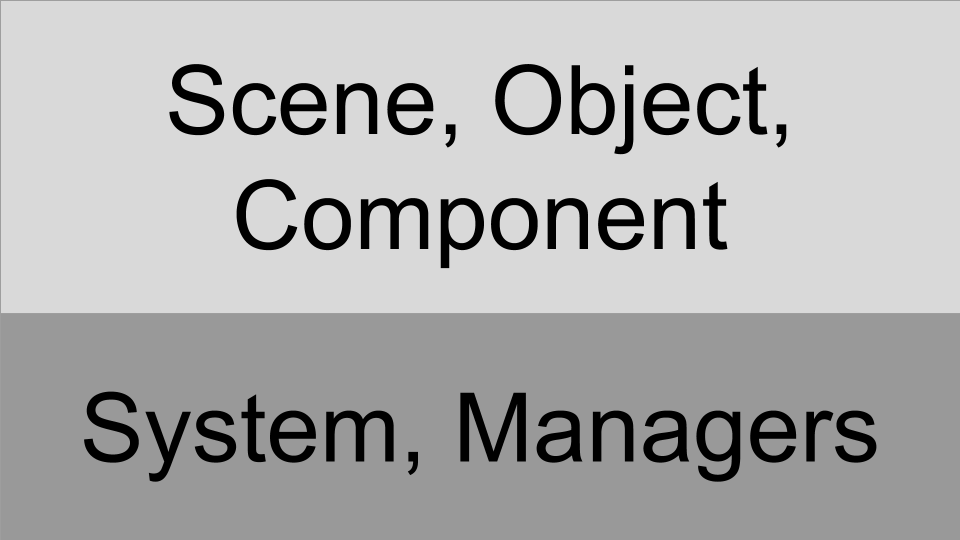

# BS-Engine Architecture

## Architecture (Simple)

## Architecture (Detail)

### Library

This layer contains math, graphics, physics, input, etc. API. It wrap external API and make basic API. It is platform-independent.

### Managers

This layer contains rendering manager, input manager, physics manager, etc. manager. Manager has method, updating myself and handling request of the object.  
As will be described later, it works another thread. So it has a job descriptor queue, which will process the contents of it.

### System

This layer contains a system that is a singleton object. Take responsibility for initializing, updating, releasing the scene and managers. Objects accesses manager through this. It also manages the beginning and end of the game.

### Descriptor

When an object makes a request to the manager, it stores the request in a job queue for later handling. Descriptor is stored in this job queue. In other words, the object communicates with the manager by creating and sending a descriptor.  
The reason for using this approach is manager runs on the other threads and batch-processes requests from other objects.

### Scene

Scene take charge for updating objects. It also creates and deletes included objects when enter or leave.

### Object

The object is simply responsible for creating, deleting, and updating components. It also helps managers and other objects to access own components.

### Component

Component is responsible for working with objects that are empty shells. This interacts with the manager to manipulate the game.
